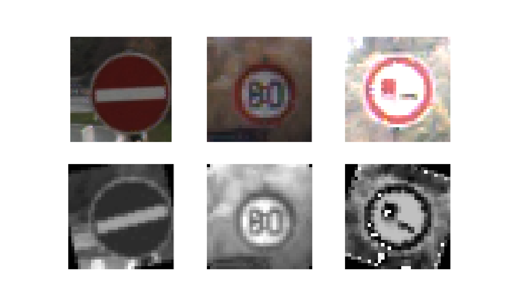
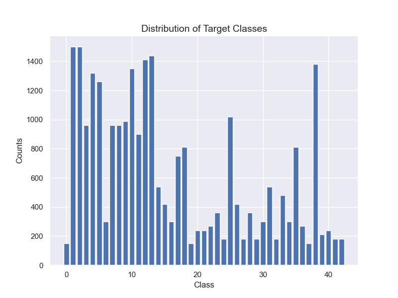
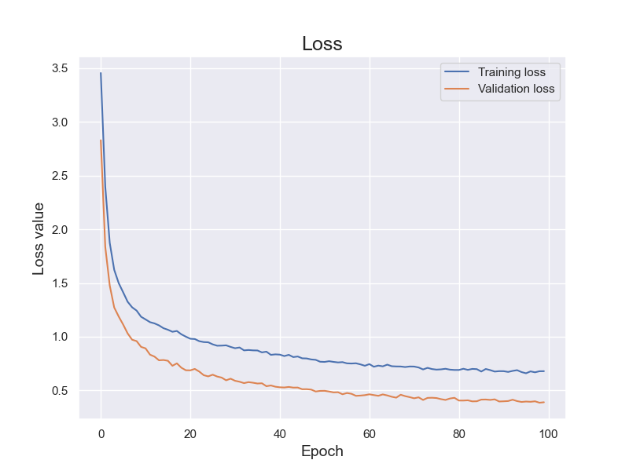
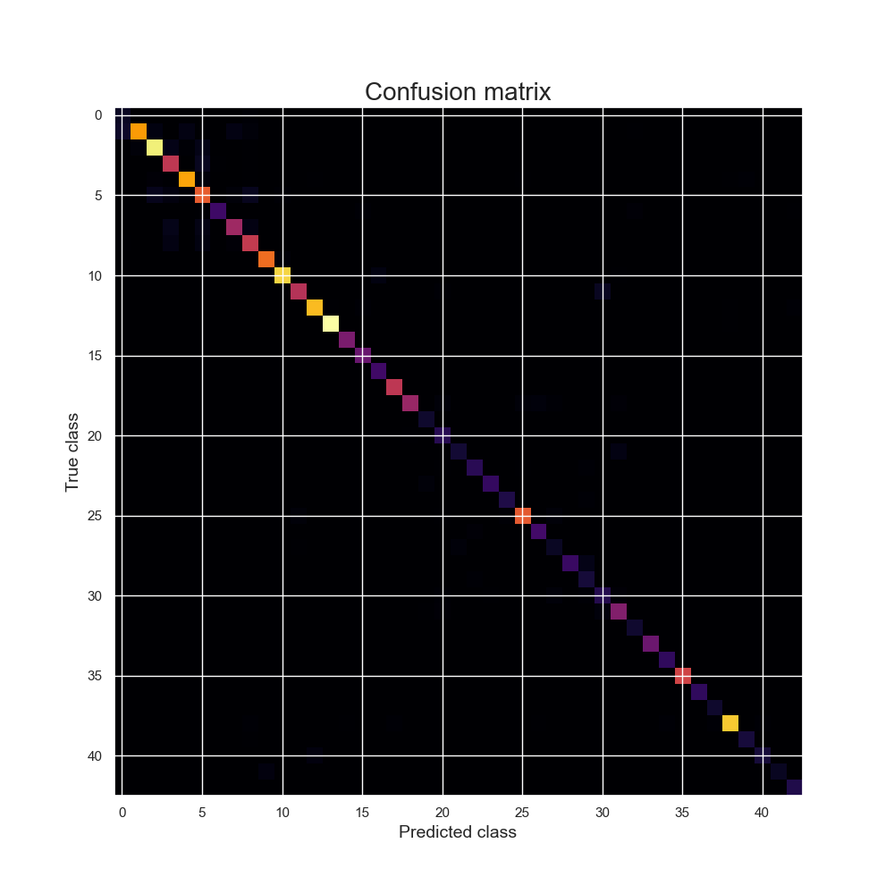

# Traffic Sign Classification

This repository contains PyTorch code that trains and evaluates a convolutional neural network. The network classifies German traffic signs into 43 categories.

### Running the scripts

If you are using conda, you can use `environment.yml` to recreate the environment that was used to develop code present in this repository.

Example usage of `training_script.py`: `python3 training_script.py --produce-plots --save-path my_model.pth`

Example usage of `prediction_script.py`: `python3 prediction_script.py --model-path $PATH_TO_MODEL --imgs-dir $DIR_WITH_IMGS` where `$PATH_TO_MODEL` is a path to the model produced using `training_script.py` and `$DIR_WITH_IMGS` is a directory that contains images that you want to classify (you can find sample images in the directory `images/sample_signs`).

### Preprocessing

The training set contains 26640 images. In order to enlarge the training set data augmentation was used, namely: random rotation between -20 and 20 degrees as well as random brightness change (between 50% and 150% of the original brightness). Additionally images were converted to grayscale in order to simplify computation (according to [this paper](http://yann.lecun.com/exdb/publis/pdf/sermanet-ijcnn-11.pdf) this can even lead to better results).

Below you can see sample transformations.

Exploratory data analysis showed that the dataset is imbalanced, so in order to mitigate that imbalance [WeightedRandomSampler](https://pytorch.org/docs/stable/data.html#torch.utils.data.WeightedRandomSampler) was used.

Below you can see the distribution of labels in the training set.

### Model

The model consists of two convolutional layers, each followed by max pooling, and two fully connected layers. The model outputs logits, so if you want to get probabilities you should apply softmax to what the model outputs.

In the table below there is the architecture of the model present in this repo (`cnn_model.pth`)

| layer           | input    | output   |
|-----------------|----------|----------|
| Convolution 3x3 | 1x32x32  | 10x30x30 |
| ReLu            | 10x30x30 | 10x30x30 |
| Max pooling     | 10x30x30 | 10x15x15 |
| Convolution 3x3 | 10x15x15 | 10x13x13 |
| ReLu            | 10x13x13 | 10x13x13 |
| Max pooling     | 10x13x13 | 10x6x6   |
| Flatten         | 10x6x6   | 3600     |
| Dropout         | 3600     | 3600     |
| Fully connected | 3600     | 100      |
| ReLu            | 100      | 100      |
| Dropout         | 100      | 100      |
| Fully connected | 100      | 43       |

### Training

The model was trained for 100 epochs. The loss can be seen in the plot below.

### Evaluation

The model achieved an accuracy of 90% on the test set. The confusion matrix can be seen below.

